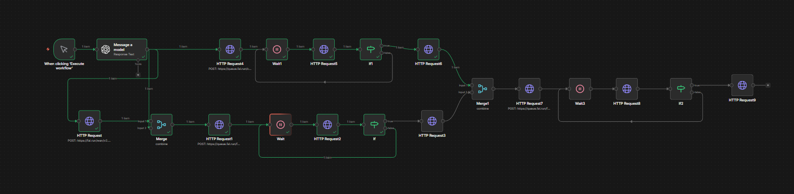
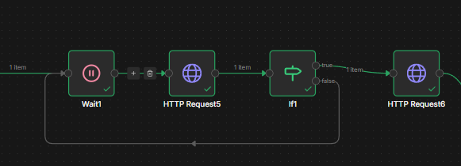

# Video Generation with Sound (copy-friendly)



## Що робимо

1. Генеруємо **фото** за промтом
2. З фото генеруємо **відео**
3. Генеруємо **звук** за промтом
4. **Склеюємо** відео + звук

Сервіси:

* OpenAI API: [https://platform.openai.com/](https://platform.openai.com/)
* fal.ai: [https://fal.ai/](https://fal.ai/)

---

## Ноди (початок)

### 1) Manual Trigger

Запуск автоматизації по кліку.

---

### 2) AI / OpenAI / Message a model

**Role:** User
**Prompt:** з файлу: [Приклад промта або ваша версія](../prompts/Video%20Generation%20with%20Sound.md)
**Важливо:** має повертати поля: `image_prompt`, `video_prompt`, `negative_prompt`, `music_promt`.

**Response format → JSON schema:**

```json
{
  "type": "object",
  "additionalProperties": false,
  "properties": {
    "frames": {
      "type": "array",
      "minItems": 1,
      "items": {
        "type": "object",
        "additionalProperties": false,
        "properties": {
          "image_prompt": { "type": "string", "minLength": 1 },
          "video_prompt": { "type": "string", "minLength": 1 },
          "negative_prompt": { "type": "string", "minLength": 1 },
          "music_promt": { "type": "string", "minLength": 1 }
        },
        "required": ["image_prompt", "video_prompt", "negative_prompt", "music_promt"]
      }
    }
  },
  "required": ["frames"]
}
```

---

## 3) HTTP Request — генерація фото (fal.ai)

**Method:**

```text
POST
```

**URL:**

```text
https://fal.run/wan/v2.6/text-to-image
```

**Header Name:**

```text
Authorization
```

**Header Value:**

```text
Key API_KEY_FAL_AI
```

**Body JSON:**

```json
{
  "prompt": "{{ $json.output[0].content[0].text.frames[0].image_prompt }}",
  "negative_prompt": "{{ $json.output[0].content[0].text.frames[0].negative_prompt }}",
  "image_size": "portrait_16_9",
  "max_images": 1,
  "enable_safety_checker": true
}
```

---

## 4) Merge — об’єднати дані

Input 1: **HTTP Request (фото)**
Input 2: **Message a model**

**Merge settings:**

```text
Mode: Combine
Combine By: Position
Number of Inputs: 2
```

---

## 5) HTTP Request — генерація відео по фото (fal.ai)

**Method:**

```text
POST
```

**URL:**

```text
https://queue.fal.run/fal-ai/kandinsky5-pro/image-to-video
```

**Header Name:**

```text
Authorization
```

**Header Value:**

```text
Key API_KEY_FAL_AI
```

**Body JSON:**

```json
{
  "prompt": "{{ $json.output[0].content[0].text.frames[0].video_prompt }}",
  "image_url": "{{ $json.images[0].url }}",
  "resolution": "512P",
  "duration": "5s",
  "num_inference_steps": 28,
  "acceleration": "regular"
}
```

---



## 6) Повторюваний блок: Wait → status → IF → result

Цей блок використаєш **3 рази**: для **відео**, **звуку**, **склейки**.

**Логіка:**

```text
1) Wait — чекаємо потрібний час
2) HTTP Request (GET) — перевіряємо статус задачі по status_url
3) IF — якщо статус COMPLETED → далі, якщо ні → назад на Wait
4) HTTP Request (GET) — забираємо результат по response_url
```

**Рекомендовані затримки:**

```text
Генерація відео: 60s
Генерація звука: 10s
Склейка відео + звук: 15s
```

### 6.2) HTTP Request — status

**Method:**

```text
GET
```

**URL:**

```text
{{ $json.status_url }}
```

### 6.3) IF — перевірка статусу

**Умова:**

```text
{{ $json.status }} == "COMPLETED"
```

TRUE → до “HTTP Request — result”
FALSE → назад до “Wait”

### 6.4) HTTP Request — result

**Method:**

```text
GET
```

**URL:**

```text
{{ $json.response_url }}
```

---

## 7) HTTP Request — генерація аудіо (fal.ai)

Підключаємо **після Message a model**.

**Method:**

```text
POST
```

**URL:**

```text
https://queue.fal.run/cassetteai/sound-effects-generator
```

**Header Name:**

```text
Authorization
```

**Header Value:**

```text
Key API_KEY_FAL_AI
```

Якщо варіант з Body кине помилку — перемкни на **Using Field Below** і встав явно:

**Body JSON:**

```json
{
  "prompt": "{{ $json.output[0].content[0].text.frames[0].music_promt }}",
  "duration": 5
}
```

---

## 8) Повторити крок 6 (для аудіо)

## 9) Merge — звести разом результат відео + аудіо

Input 1: **8 (аудіо result)**
Input 2: **6 (відео result)**

**Merge settings:**

```text
Mode: Combine
Combine By: Position
Number of Inputs: 2
```

---

## 10) HTTP Request — склейка відео + аудіо (fal.ai)

**Method:**

```text
POST
```

**URL:**

```text
https://queue.fal.run/fal-ai/ffmpeg-api/merge-audio-video
```

**Header Name:**

```text
Authorization
```

**Header Value:**

```text
Key API_KEY_FAL_AI
```

Якщо кине помилку — **Using Field Below** і встав:

**Body JSON:**

```json
{
  "video_url": "{{ $json.video.url }}",
  "audio_url": "{{ $json.audio_file.url }}",
  "start_offset": 0
}
```

---

## 11) Повторити крок 6 (для merge)

Після COMPLETED — у result/response отримаєш фінальний файл (URL) і зможеш відкрити відео.